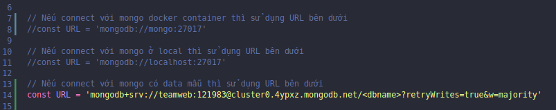

# Thiết lập môi trường và run source
### ***Bước 1. Tải docker và docker-compose***
----------------------------------------
- ***Tải docker trên window - Nếu môi trường là window***

- ***Tải docker trên linux - Nếu môi trường là linux***

<br>

### ***Bước 2. Run project***
-----------------------
```
bash start.sh
```

### ***$ Lưu ý***
-----------------------
```
Nếu không run bằng docker thì có thể thay đổi đường dẫn URL thành 
```



<br>
<br>

# Danh sách api 

### 1. ***Normal API*** 


- ***GET  /lab01*** <br> 
render ra trang tĩnh lab01

- ***GET /lab02*** <br>
render ra trang tĩnh lab02

- ***GET /admin*** <br>
render ra trang admin

### 2. ***Authentication API*** 
- ***POST /auth/login*** <br>
login và nhận về token, tuy nhiên để đơn giản nên không xác thực với token


### 3. ***CURD API*** 
- ***POST  /product/add*** <br> 
Add product

- ***GET /product/all*** <br>
Query tất cả product

- ***PUT /product*** <br>
Update product


- ***POST /product/delete*** <br>
Delete product


<br>
<br>

# Chi tiết api 
Link dưới đây là chi tiết api
```
https://docs.google.com/document/d/1nrh9el0yGEi3CmbhM44v_JKL3hQiUBn1vgqFDAc16KQ/edit?usp=sharing
```

<br>
<br> 


